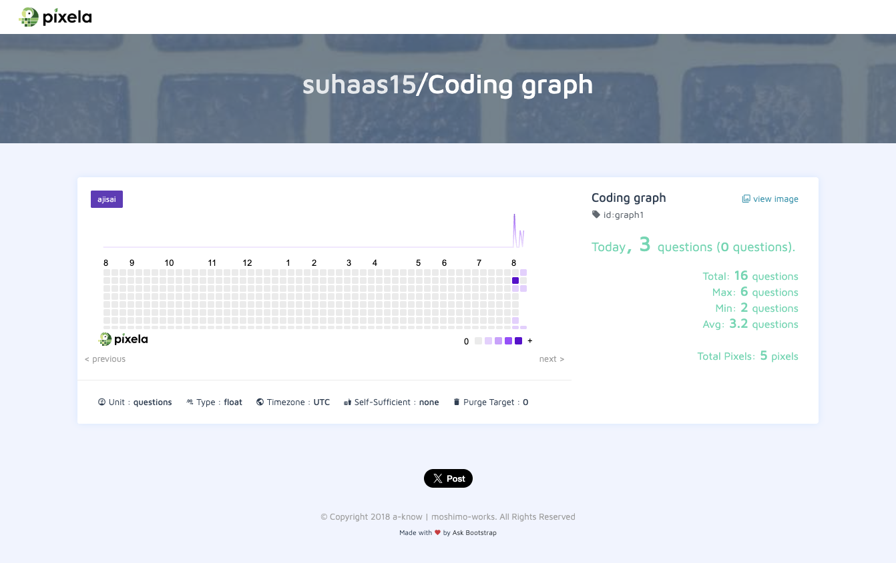

# Habit Tracker with Pixela & GitHub Actions

Turn your GitHub contributions into a colorful habit graph on Pixela—automatically! Every time you push code (or at a scheduled time), GitHub Actions fires up a Python script (`main.py`) that pulls your daily activity and posts it to your Pixela API graph.

Unlike GitHub’s traditional green contribution graph, this one uses a purple (ajisai) theme—making your progress more personalized and visually distinct.

---

## 🚀 Features

- **Automatic tracking**: No more manual scripts—runs on every push to **`main`** and nightly.  
- **GitHub GraphQL**: Fetches your true daily contributions (commits, issues, PRs) via GitHub’s GraphQL API.  
- **Pixela API**: Uses Pixela’s simple REST endpoints to record and visualize your habit data.  
- **Customizable**: Tweak triggers, schedule, or the data you post in just a few lines of YAML.

---

## 📋 Prerequisites

- **Pixela account** with a graph created (https://pixe.la/#/)  
- **GitHub repo** for your code.  
- **GitHub token** with minimum scopes (`read:user`, `repo`) or use the built-in `GITHUB_TOKEN`.  
- **Python 3.x** and the `requests` library.

---

## 📂 Project Structure

```plaintext
├── .github/
│   └── workflows/
│       └── pixela.yml     # Workflow: when and how we run
├── main.py                # Script: fetch GitHub data + send to Pixela
└── README.md              # This guide
```

**`main.py`** breakdown:  
1. **Authenticate** with GitHub & Pixela using environment variables.  
2. **Query** GitHub GraphQL API for today’s total contributions.  
3. **POST** that number to your Pixela graph endpoint.

---

## 🎯 Setup

1. **Clone** this repo:
   ```bash
   git clone https://github.com/yourusername/your-repo.git
   cd your-repo
   ```
2. **Add your secrets** in **Settings → Secrets and variables → Actions**:
   - `PIXELA_TOKEN` (your Pixela API token)  
   - `GH_PAT` (your GitHub Personal Access Token) **or** rely on `${{ secrets.GITHUB_TOKEN }}`
3. **Install Python deps**:
   ```bash
   python3 -m venv venv
   source venv/bin/activate
   pip install requests
   ```

---

## 🎒 Usage

- **Local run** (for testing):
  ```bash
  export PIXELA_TOKEN="<your-pixela-token>"
  export GH_PAT="<your-pat>"          # if used
  python main.py
  ```
- **View your graph**:  
  Visit `https://pixe.la/v1/users/<username>/graphs/<graph-id>.html` in a browser.

---

## ⚙️ GitHub Actions Workflow

Located at `.github/workflows/pixela.yml`, this file defines:

- **Triggers**: `push` on `main` & daily `cron` at 23:59 UTC.  
- **Jobs**: checkout, setup Python, install deps, run `main.py`.

```yaml
name: Update Habit Tracker

on:
  push:
    branches: [ main ]
  schedule:
    - cron: "59 23 * * *"

jobs:
  track:
    runs-on: ubuntu-latest
    steps:
      - uses: actions/checkout@v4
      - uses: actions/setup-python@v4
        with:
          python-version: '3.x'
      - run: pip install requests
      - run: python main.py
        env:
          PIXELA_TOKEN: ${{ secrets.PIXELA_TOKEN }}
          GH_PAT:        ${{ secrets.GH_PAT }}  # or GITHUB_TOKEN
```

## 🌸 Visual Preview



---

## 🔧 Customization Tips

- **Events**: Add `pull_request`, `issues`, or manual `workflow_dispatch` under `on:`.  
- **Schedule**: Change the `cron` for a different time (see [Crontab guru](https://crontab.guru)).  
- **Data logic**: Modify `main.py` to post only commits, or sum lines changed, etc.

---

## 🐞 Troubleshooting

1. **No workflow run?** Ensure `pixela.yml` is on `main` branch and indentation is correct.  
2. **Authentication errors?** Re-check secret names and values.  
3. **Script failures?** Inspect logs under **Actions → Update Habit Tracker → Runs**.

---

## 📖 Pixela API Overview

Pixela is a lightweight habit-tracking service. You:  
1. **Create a user**: `POST /v1/users`  
2. **Define a graph**: `POST /v1/users/<user>/graphs`  
3. **Add a pixel**: `POST /v1/users/<user>/graphs/<graph-id>` with `{ date, quantity }`  

Our `main.py` handles step (3), using your existing graph to mark daily progress. Learn more at [Pixela Docs](https://pixe.la/).

---
